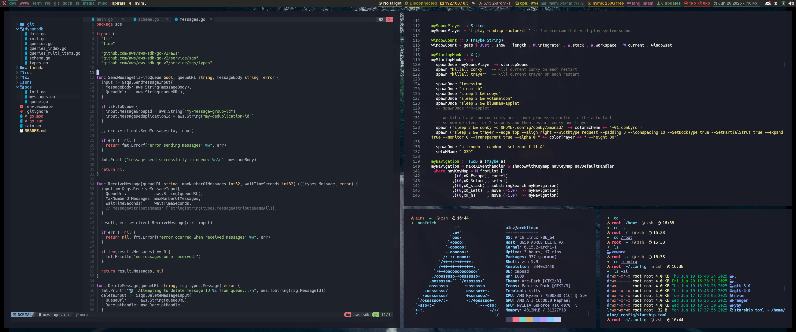

### Dependencies

```bash
sudo pacman -S --noconfirm \
  # Window Managers & Core Utils
  qtile xmonad xmonad-contrib xmobar xdotool \
  # System & Utilities
  pacman-contrib trayer picom scrot nitrogen python-psutil \
  # Theming & Appearance
  papirus-icon-theme gnome-themes-extra breeze-gtk breeze gnome-tweaks lxappearance \
  # Terminal & Shell
  zsh zsh-autocomplete zsh-autosuggestions zsh-syntax-highlighting \
  # Clipboard & File Management (ranger)
  xclip copyq ueberzugpp ffmpegthumbnailer poppler \
  # Fonts & Emojis
  noto-fonts-emoji rofi-emoji \
  # Bluetooth
  bluez bluez-utils blueman \
  # Keyring
  gnome-keyring seahorse
```

```bash
yay -S --noconfirm pwvucontrol arc-gtk-theme
```

### Font Installation

```bash
sh install_fonts.sh
```

To list all installed Nerd Font families recognized by your system:

```bash
fc-list | grep "Nerd Font" | cut -d: -f2 | sort -u
```

or you can use font manager

```bash
sudo pacman -S font-manager
```

Give execute permissions to local scripts:

```bash
chmod +x ~/.local/bin/*
chmod +x ~/xmobar/trayer-padding-icon.sh
```

### Zsh

1. Install Zsh and plugins:

```bash
sudo pacman -S zsh zsh-autosuggestions zsh-syntax-highlighting zsh-autocomplete
```

2. Change default shell for user and root:

```bash
sudo usermod --shell /usr/bin/zsh a1nz
sudo usermod --shell /usr/bin/zsh root
```

3. Link root's zshrc to user configuration:

```bash
sudo ln -sf /home/a1nz/.zshrc /root/.zshrc
```

### SDDM Theme

Install the Astronaut theme following the automated configuration:

```bash
# Visit: https://github.com/Keyitdev/sddm-astronaut-theme
# Follow the automatic configuration
```

### GRUB Theme

1. Install Elegant GRUB theme:

```bash
# Visit: https://github.com/vinceliuice/Elegant-grub2-themes
```

2. Configuration details:
   - Theme path: `/boot/grub/themes/Elegant-forest-window-right-dark`
   - Configuration file: `/etc/default/grub`
   - Apply changes: `sudo grub-mkconfig -o /boot/grub/grub.cfg`

Convert GRUB background for ultrawide displays:
```bash
magick \
  \( background.jpg -crop 1x1080+0+0 -resize 440x1440! \) \
  \( background.jpg -resize 2560x1440! \) \
  \( background.jpg -crop 1x1080+1919+0 -resize 440x1440! \) \
  +append extended_image.jpg
```

### VMware Tools Setup

```bash
sudo pacman -S open-vm-tools
sudo systemctl enable vmtoolsd.service
sudo systemctl enable vmware-vmblock-fuse.service
```

### Display Configuration for VM

Set up custom resolution for ultrawide displays:

```bash
sudo pacman -S xorg-xrandr

# Generate modeline for 3440x1440@60Hz
cvt 3440 1440 60 -r

# Add custom resolution
xrandr --newmode "3440x1440R" 319.75 3440 3488 3520 3600 1440 1443 1453 1481 +hsync -vsync
xrandr --addmode Virtual-1 "3440x1440R"
xrandr --output Virtual-1 --mode "3440x1440R"
```